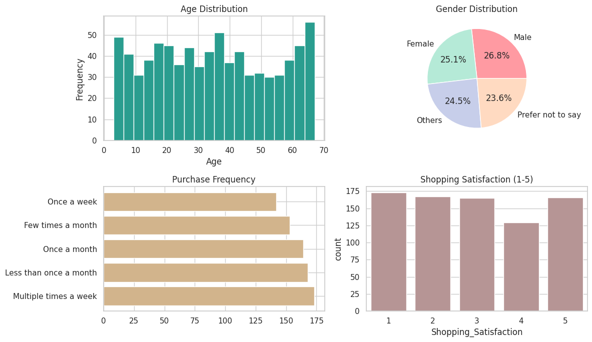
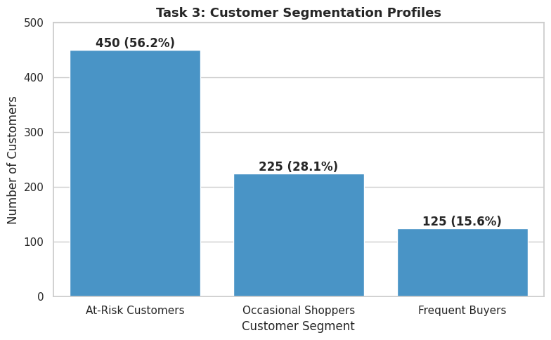
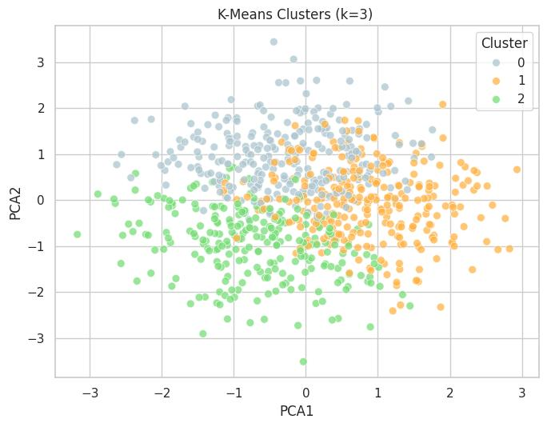
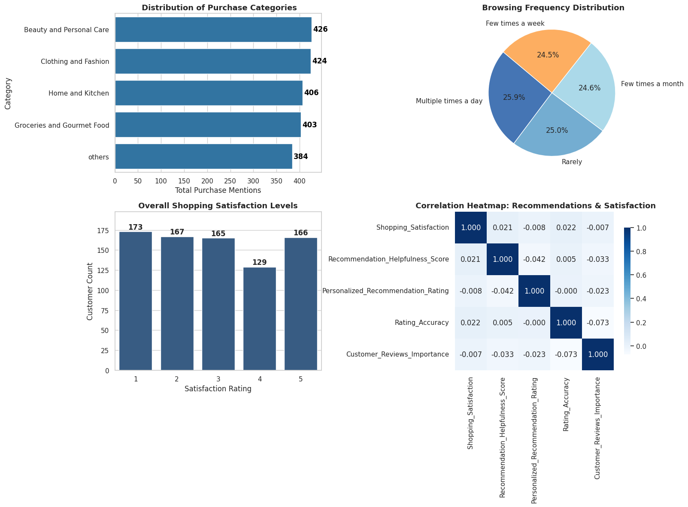

**Market Basket Analysis with Python — Target**

Customer purchasing behavior and product recommendation analysis for Target, a global e-commerce platform, built as part of an Internshala Data-Driven Machine Learning training course.

**Problem Statement**

As Customer Insights Analyst, the goal is to understand customer purchasing behavior, product affinities, and engagement trends to improve personalization, cross-selling, and inventory/marketing strategy. Key questions:

What products/categories are frequently purchased together (cross-selling opportunities)?
How do purchasing patterns vary across demographics?
Can customers be segmented by buying behavior for personalized promotions?
Which factors drive repeat purchases and loyalty?

**Dataset**

**Target.csv** — 800 customer survey responses across 24 fields, covering demographics, purchase behavior, browsing behavior, cart behavior, reviews/recommendations, and satisfaction.

📂 **Project Tasks & WorkflowData** 

**Cleaning & Preparation:** Handled missing values (imputing Product_Search_Method), stripped whitespaces, removed duplicates, and coerced rating scales into numeric dtypes.  

**Descriptive Behavior Analysis:** Examined age distributions, gender splits, purchase frequencies, and popular product categories (Beauty & Personal Care and Clothing & Fashion leading).   

**Customer Segmentation & Profiling:** Built a rule-based segmentation model categorizing users into Frequent Buyers, Occasional Shoppers, and At-Risk Customers, validated via K-Means clustering and PCA.  

**Recommendation & Review Insights:** Analyzed correlations between recommendation helpfulness, review reliability, and shopping satisfaction using heatmaps and statistical aggregations.   

**Dashboard & Reporting:** Consolidated metrics into a unified visual reporting dashboard. 

📊 Visual Dashboard & Key Insights
1. Demographic & Behavioral OverviewThe customer base skews young-to-middle-aged, with Beauty & Personal Care and Clothing & Fashion standing out as the strongest product categories.   

2. Customer Segmentation ProfilesUsing a custom rule-based segmentation, customers were categorized into At-Risk, Occasional Shoppers, and Frequent Buyers, revealing that over 56% of the customer base falls into the At-Risk category. 

3. K-Means Clustering & PCA ValidationK-Means clustering ($k=3$) and PCA projection were used to independently validate behavioral groupings, highlighting age and trust-orientation as key independent axes.   

4. Recommendation & Satisfaction Correlation HeatmapA correlation heatmap confirms that traditional recommendation helpfulness and review reliance metrics show little direct linear link to overall shopping satisfaction

💡**Key Findings & Business Recommendations**

**At-Risk Majority:** 56.25% of the customer base falls into the At-Risk segment, heavily driven by high shipping costs.

**Recommendation:** Introduce shipping-cost thresholds and transparent checkout indicators.  

**Occasional Shopper Paradox:** Occasional shoppers buy frequently but report very low satisfaction (1.94/5), representing a high-priority retention target[cite: 1].

**Recommendation Disconnect:** Current recommendation exposure frequency shows little measurable link to satisfaction, pointing to a need to pivot success metrics from clicks to downstream satisfaction[cite: 1].

🛠️ **Tech Stack & LibrariesLanguage**:

**Python   Data Manipulation & Analysis:** Pandas, NumPy

**Machine Learning:** Scikit-learn (K-Means Clustering, PCA, LabelEncoder, StandardScaler)

**Data Visualization:** Matplotlib, Seaborn
